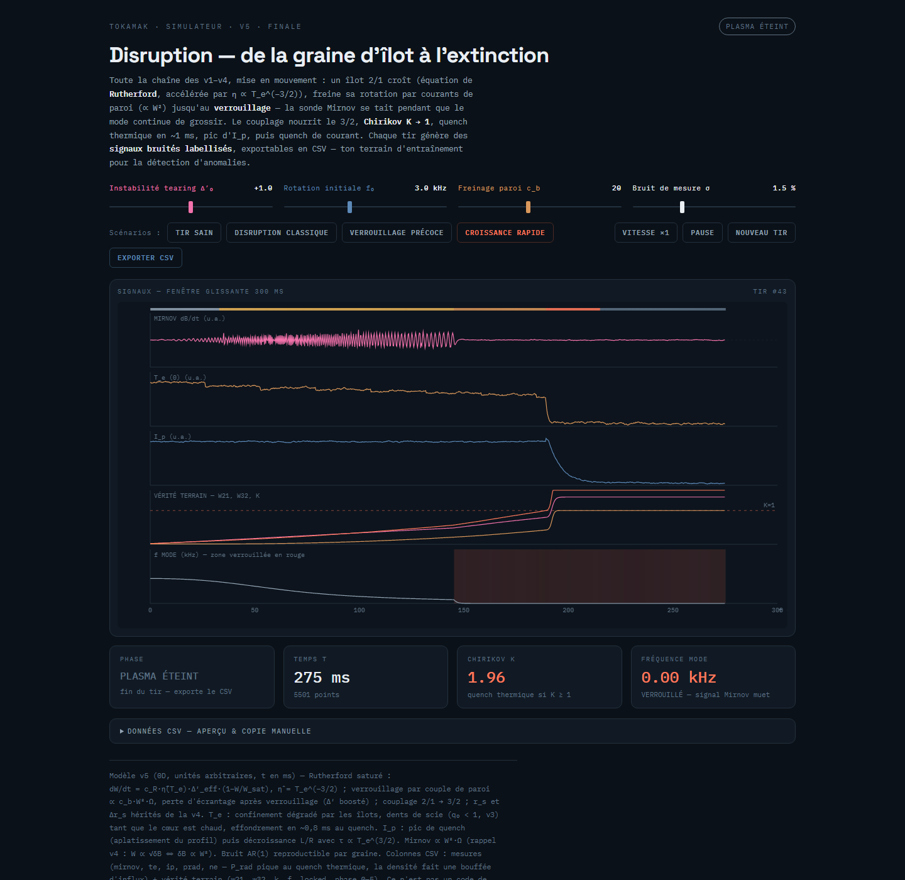
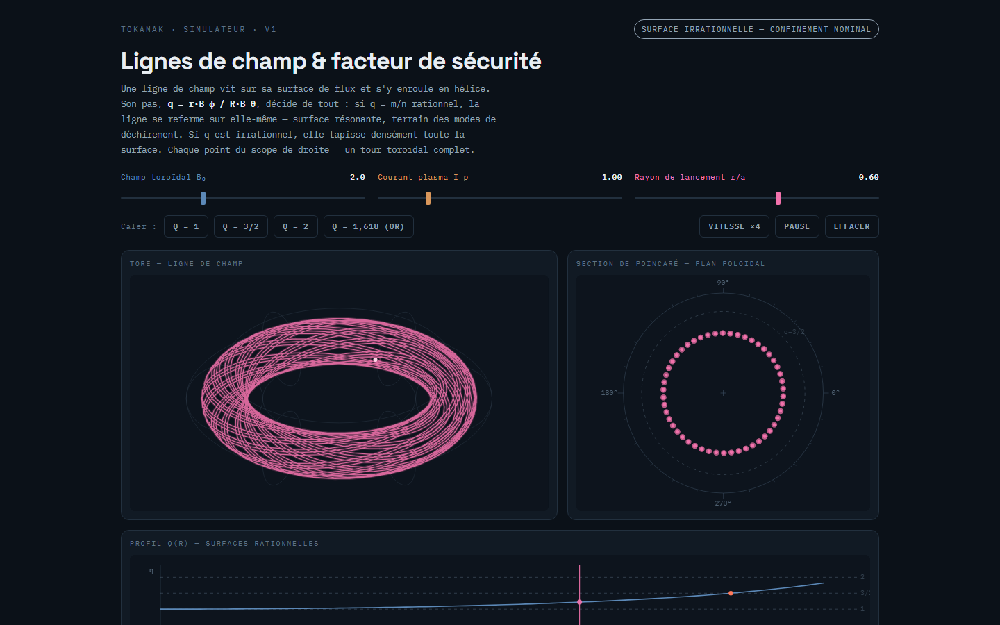
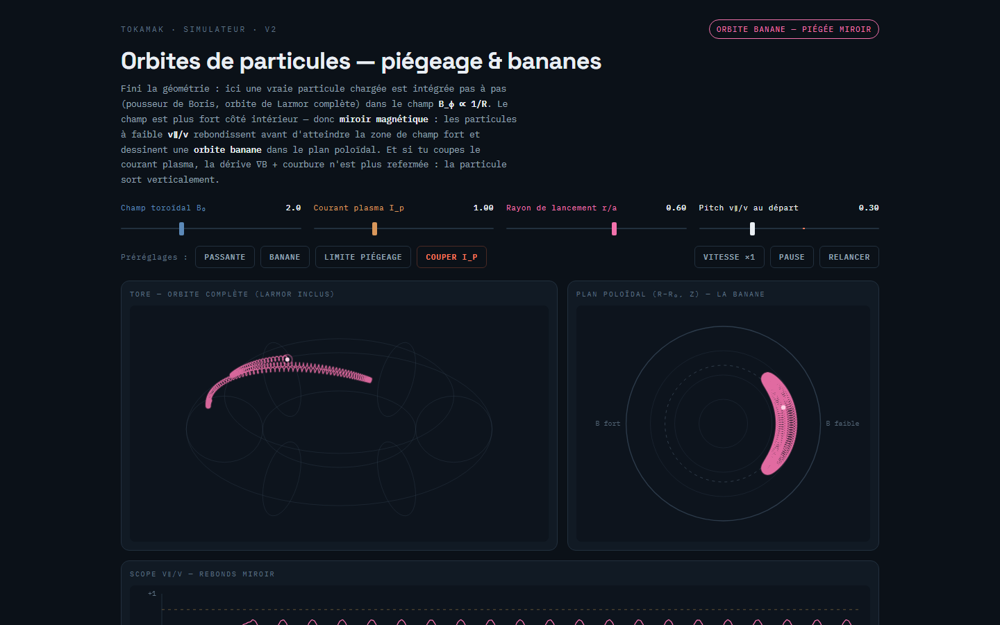
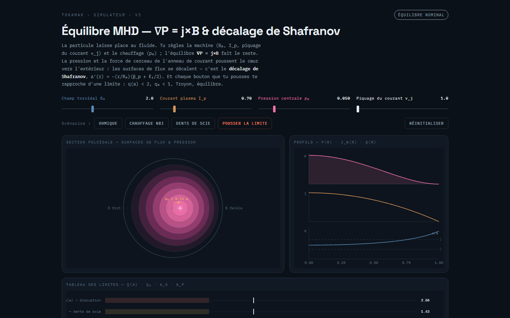
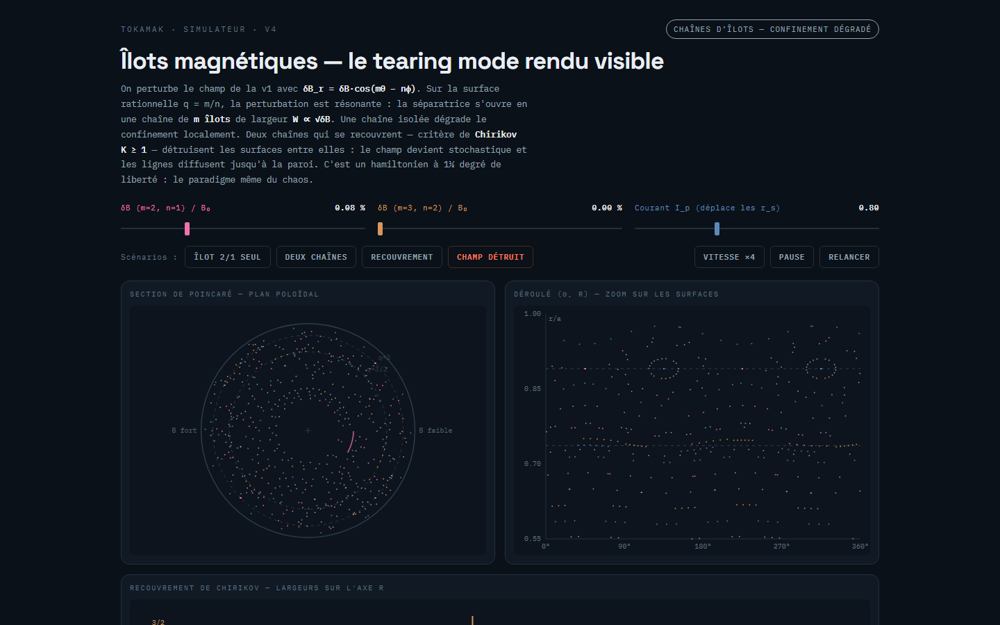
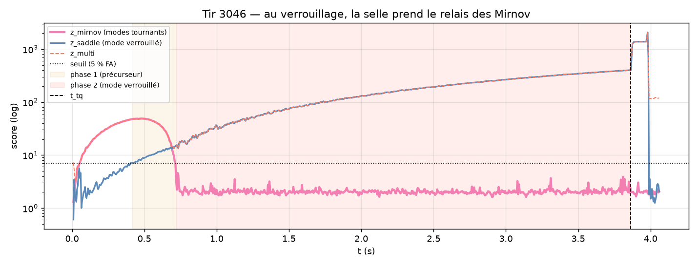

# Tokamak — simulateur pédagogique & prédiction de disruptions

> Cinq simulateurs interactifs de physique des tokamaks (pages HTML autonomes, zéro
> dépendance), un générateur déterministe de datasets synthétiques labellisés, et une
> baseline ML de détection précoce de disruptions — le tout tenu par des tests de
> régression physique.



**English summary** — A self-contained tokamak physics playground: five interactive
HTML simulators (field lines & safety factor, particle orbits, MHD equilibrium,
magnetic islands, full disruption dynamics), a deterministic generator of labelled
synthetic disruption time series (arbitrary-units v5, plus an SI-calibrated v6 engine
with a 22-channel control-room diagnostics layer at 10 kHz), and a Python ML baseline
for early disruption detection. The physics is pinned down by 55 regression tests and
a validation battery (dt-convergence, extreme-range sweeps, metamorphic properties);
every dataset is reproducible bit-for-bit from a seed.

## Les cinq actes

Chaque page s'ouvre **directement dans le navigateur** (double-clic, aucun serveur,
aucune installation) et suit la chaîne causale d'une disruption :

| | |
|---|---|
| [](web/tokamak_v1.html) **Acte I — Lignes de champ & facteur q** : enroulement hélicoïdal, surfaces rationnelles, pourquoi q = 2 est une ligne de faille. | [](web/tokamak_v2.html) **Acte II — Orbites de particules** : pousseur de Boris, miroir magnétique, orbites bananes, dérive verticale sans courant plasma. |
| [](web/tokamak_v3.html) **Acte III — Équilibre MHD** : ∇P = j×B, décalage de Shafranov, limites opérationnelles (q(a), Troyon, densité). | [](web/tokamak_v4.html) **Acte IV — Îlots magnétiques** : tearing mode, chaînes d'îlots, critère de recouvrement de Chirikov K ≥ 1. |

**[Acte V — Disruption](web/tokamak_v5.html)** (capture ci-dessus) : équation de
Rutherford, verrouillage de mode par couple de paroi, quench thermique puis quench de
courant. Chaque tir produit des signaux bruités labellisés exportables en CSV.
Sommaire : [web/index.html](web/index.html).

## Le banc ML — prédire la disruption avant qu'elle n'arrive

Le modèle physique de la v5 ([model/tokamak_model.js](model/tokamak_model.js)) tourne
tel quel en Node : on génère des datasets entiers en CLI, avec la même physique que la
page web, reproductibles octet pour octet par seed (le bruit de mesure AR(1) est la
seule stochasticité, et il est seedé).

```bash
# v5 — unités arbitraires, 5 canaux à 4 kHz (un CSV par tir + manifest)
node scripts/generate.js --shots 200 --out data/run01 --disrupt-ratio 0.5 --seed-base 1000

# v6 — unités SI (machine JET-like), 0D à 1 kHz
node scripts/generate_v6.js --shots 200 --out data/run_v6 --disrupt-ratio 0.5 --seed-base 2000

# v6-diag — 22 canaux bruts de salle de contrôle à 10 kHz (CSV.gz) :
# 8 bobines de Mirnov, 4 boucles à selle, 6 rayons ECE, bolométrie, interférométrie…
node scripts/generate_v6_diags.js --shots 100 --out data/run_v6_diag02 --disrupt-ratio 0.5 --seed-base 3000
```

La baseline Python ([ml/](ml/)) extrait des features fenêtrées, calibre des détecteurs
z-score robustes (médiane/MAD sur tirs sains) et une régression logistique, puis
évalue **en conditions réelles** : split par tir, seuils calibrés sur le train seul,
et sur tir disruptif seules les fenêtres *antérieures* au quench thermique comptent.

```bash
python ml/features.py data/run01 && python ml/baseline.py data/run01 && python ml/evaluate.py data/run01
# variantes _v6 pour les datasets diagnostics
```

### Le résultat central : le trou aveugle du mode verrouillé

Le précurseur d'une disruption est d'abord un mode *tournant*, très visible sur les
bobines de Mirnov (dB/dt ∝ W²·Ω). Mais quand l'îlot se verrouille (Ω → 0), la sonde
se tait **alors que le danger continue de croître** — c'est le trou aveugle historique
de la détection purement magnétique, et les datasets le reproduisent :

| Détecteur (v6-diag, fenêtres pré-quench tenues) | Mode tournant | Mode verrouillé |
|---|---|---|
| `z_mirnov` (réseau Mirnov) | 97 % | **0 %** |
| `z_saddle` (boucles à selle, δB_r statique) | 100 % | **100 %** |
| `z_multi` (multi-diagnostic) | 100 % | 100 % |

La réponse au trou aveugle n'est pas de la mémoire d'alarme, c'est **le bon capteur** :
le champ radial statique de l'îlot verrouillé reste visible sur les boucles à selle
(l'équivalent du détecteur de mode verrouillé des machines réelles) — et en v5, c'est
la montée radiative (P_rad) qui prend le relais. Le détecteur multi-canal hérite de
cette complémentarité physique : 100 % de détection, 0 % de fausses alarmes sur le
test, alerte médiane ~2 s avant le quench.



Résultats complets, protocole et courbes : [ml/RESULTS.md](ml/RESULTS.md) (v5) et
[ml/RESULTS_V6.md](ml/RESULTS_V6.md) (v6-diag).

## La physique v6 — unités SI, falsifiable contre la littérature

Le moteur v6 ([model/tokamak_model_v6.js](model/tokamak_model_v6.js)) est un modèle 0D
sur machine JET-like (R₀ = 3 m, B₀ = 3 T, Ip = 2.5 MA, préréglages surchargeables)
dont **chaque terme est une expression publiée** : résistivité de Spitzer, équation de
Rutherford (+ terme bootstrap NTM optionnel), couple de paroi résistive de Fitzpatrick,
scaling de confinement IPB98(y,2), décroissance L/R du courant. Les tests comparent
ses sorties à des chiffres expérimentaux publiés (ITER Physics Basis, de Vries 2011,
Sweeney 2017, Wesson) — le modèle est falsifiable contre la littérature, pas contre
lui-même. Détails, équations et contrat épistémique :
[docs/V6_PHYSIQUE.md](docs/V6_PHYSIQUE.md).

## Tests & validation

```bash
npm test          # 55 tests de régression physique (node:test, zéro dépendance)
npm run valide    # batterie v6 : convergence en dt, balayage extrême anti-NaN,
                  # propriétés métamorphiques, bornes physiques des capteurs
```

Garanties tenues par les tests : déterminisme octet pour octet par seed, bruit
purement observationnel (la dynamique est identique à σ = 0 et σ = 5 %), parité
stricte entre l'export CSV de la page web et celui du générateur CLI, monotonies
physiques (tTQ décroît avec l'instabilité, Te max croît avec le chauffage…).

## Arborescence

```
web/       5 pages HTML autonomes (file://, vanilla JS, zéro build)
model/     moteurs physiques purs (v5, v6, diagnostics v6) — double export navigateur/Node
scripts/   générateurs de datasets CLI + batterie de validation v6
tests/     tests de régression physique (node:test)
ml/        baseline Python (features, détecteurs, évaluation, résultats)
docs/      physique v6, captures d'écran
data/      datasets générés (gitignoré — régénérable à l'identique par seed)
```

## Démarrage rapide

- **Simulateurs** : ouvrir `web/index.html` dans un navigateur. C'est tout.
- **Datasets** : Node ≥ 18, aucune dépendance npm.
- **ML** : Python ≥ 3.10 — `pip install numpy pandas scikit-learn matplotlib`.

## Licence

[MIT](LICENSE)
